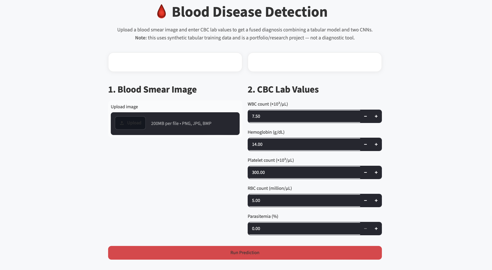
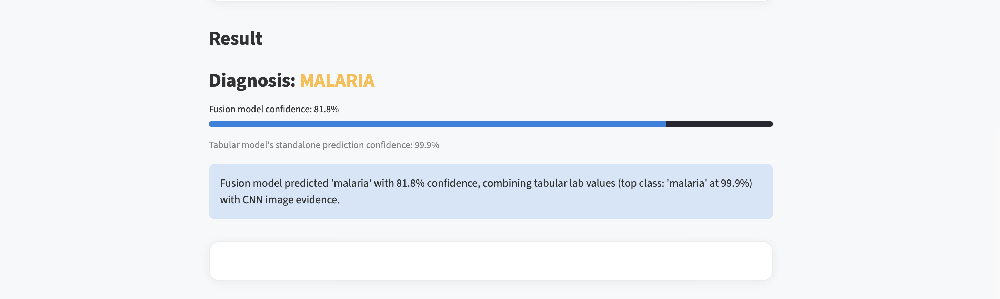
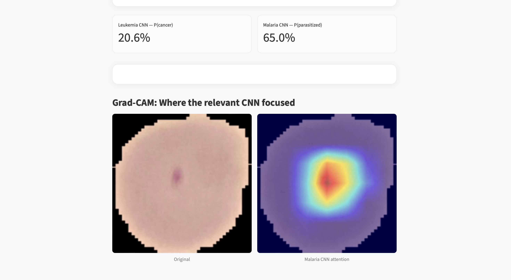
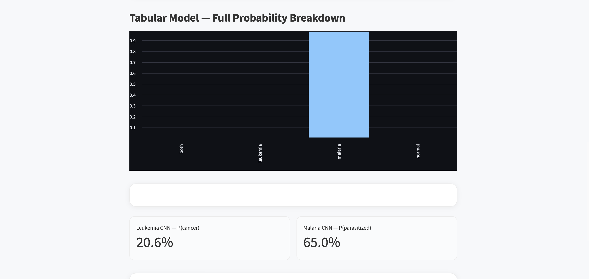

# 🩸 Blood Disease Detection

A multi-modal diagnostic system that predicts **leukemia**, **malaria**, **both**, or **normal** from a blood smear image and CBC (Complete Blood Count) lab values — combining two CNNs, an XGBoost tabular model, and a learned fusion model with Grad-CAM explainability.

Built as a portfolio project to demonstrate end-to-end ML engineering: data sourcing, transfer learning, model evaluation, explainability, learned multi-model fusion, and a working interactive demo.

> ⚠️ **Not a diagnostic tool.** This is a research/portfolio project. The tabular model is trained on synthetic data (see [Dataset Sources](docs/Dataset_Sources.md)).

---

## What it does

Upload a blood smear image + enter CBC lab values → get a fused diagnosis with supporting evidence from both the image and the lab values, plus a Grad-CAM heatmap showing where the relevant CNN focused.

## Demo

<table>
<tr>
<td width="50%">

<p align="center"><i>App homepage — upload an image and enter CBC values</i></p>
</td>
<td width="50%">

<p align="center"><i>Fused diagnosis combining tabular and CNN model outputs</i></p>
</td>
</tr>
<tr>
<td width="50%">

<p align="center"><i>Grad-CAM highlighting the model's attention on the parasitized region</i></p>
</td>
<td width="50%">

<p align="center"><i>Tabular model's full probability breakdown across all 4 classes</i></p>
</td>
</tr>
</table>

## Architecture

Three independently-trained models feed into a learned fusion layer:

| Component | Model | Task | Result |
|---|---|---|---|
| Leukemia CNN | ResNet18 (transfer learning) | Cancer vs healthy | 85.4% accuracy, AUC 0.91 |
| Malaria CNN | ResNet18 (transfer learning) | Parasitized vs uninfected | 95.5% accuracy, AUC 0.99 |
| Tabular model | XGBoost | 4-class: normal/leukemia/malaria/both | Trained on synthetic CBC data |
| Fusion | Logistic Regression (learned) | Combines all 6 model outputs (4 tabular probabilities + 2 CNN scores) into one diagnosis | 88.3% (fusion-only), 87.5% end-to-end |

Full design rationale, including real engineering issues found and fixed along the way (an XGBoost/PyTorch process conflict, a Grad-CAM attention finding, and the transition from rule-based to learned fusion), is documented in [`docs/Architecture.md`](docs/Architecture.md).

## Demo

```bash
streamlit run app/streamlit_app.py
```

Upload a blood smear image, enter CBC values, and get a diagnosis with a full probability breakdown, both CNN confidences, and a Grad-CAM visualization.

## Project structure

BloodDiseaseDetection/
├── data/              # raw + processed datasets (images + synthetic tabular CBC data)
├── src/
│   ├── data/          # dataset classes, preprocessing, synthetic data generation
│   ├── models/        # CNN, XGBoost, and fusion model definitions
│   ├── training/       # training scripts for all models (CNNs, tabular, fusion)
│   ├── evaluation/     # metrics, confusion matrices, classification reports, end-to-end eval
│   ├── explainability/ # Grad-CAM
│   ├── inference/      # end-to-end prediction pipeline + fusion logic
│   └── utils/          # config, device handling
├── app/               # Streamlit demo
├── saved_models/      # trained model weights
├── results/           # evaluation outputs, Grad-CAM images, end-to-end eval results
└── docs/              # architecture, dataset sources, setup guide

## Key results

**Leukemia CNN** — Test accuracy 85.38% | Sensitivity 88.54% | Specificity 78.59% | AUC 0.9078
**Malaria CNN** — Test accuracy 95.48% | Sensitivity 94.87% | Specificity 96.08% | AUC 0.9909
**Fusion model** — 88.3% accuracy on held-out fusion test data (deliberately ambiguous lab values)
**End-to-end system** — 87.5% accuracy on 120 held-out cases, evaluated via the complete pipeline (tabular subprocess + both CNNs + learned fusion), with all misclassifications occurring between clinically-related classes (e.g. malaria↔both), not unrelated ones

Both CNNs were evaluated beyond raw accuracy (confusion matrix, sensitivity/specificity) since accuracy alone is misleading for imbalanced/medical classification tasks. The fusion model and full system were evaluated on deliberately-ambiguous, held-out synthetic data — not the same easy distribution used in initial training — to produce a credible, non-inflated accuracy number. See [`docs/Architecture.md`](docs/Architecture.md) for the full reasoning.

## Setup

Full instructions in [`docs/Setup_Guide.md`](docs/Setup_Guide.md). Quick version:

```bash
python3 -m venv .venv
source .venv/bin/activate
pip install -r requirements.txt
brew install libomp   # required by XGBoost on macOS

# generate synthetic tabular data
python3 -m src.data.generate_tabular_data
python3 -m src.data.preprocess_tabular

# train all 3 base models
python3 -m src.training.train_leukemia_cnn
python3 -m src.training.train_malaria_cnn
python3 -m src.training.train_tabular_model

# generate fusion training data and train the fusion model
python3 -m src.data.generate_fusion_training_data
python3 -m src.training.train_fusion_model

# run the demo
streamlit run app/streamlit_app.py
```

## Known limitations

- **Tabular data is synthetic**, grounded in published clinical CBC reference ranges rather than real patient records (no combined public dataset exists — see [`docs/Dataset_Sources.md`](docs/Dataset_Sources.md)).
- **Tabular model has very sharp decision boundaries** — manual probing across dozens of lab value combinations found it confidently decisive almost everywhere, making naturally-occurring ambiguous real-world cases rare. Fusion model training and validation instead used deliberately-blended synthetic ambiguity and hand-crafted conflict tests to properly exercise the fusion logic.
- **Both image and lab values are required** — the system doesn't support partial (image-only or lab-only) input, a deliberate scope decision explained in [`docs/Architecture.md`](docs/Architecture.md).
- **Grad-CAM attention shows some edge-bias** — model attention on the leukemia CNN skews toward cell boundaries rather than purely interior structure. Investigated and documented, not fully resolved — see [`docs/Architecture.md`](docs/Architecture.md).

## Docs

- [`docs/Architecture.md`](docs/Architecture.md) — system design, fusion logic, engineering findings
- [`docs/Dataset_Sources.md`](docs/Dataset_Sources.md) — dataset citations, synthetic data methodology
- [`docs/Setup_Guide.md`](docs/Setup_Guide.md) — full setup and run instructions

## Tech stack

PyTorch, torchvision (ResNet18), XGBoost, scikit-learn (Logistic Regression fusion model), pytorch-grad-cam, Streamlit, pandas, NumPy

---

**Made by Arrsh Tripathi**
23BCI0191


